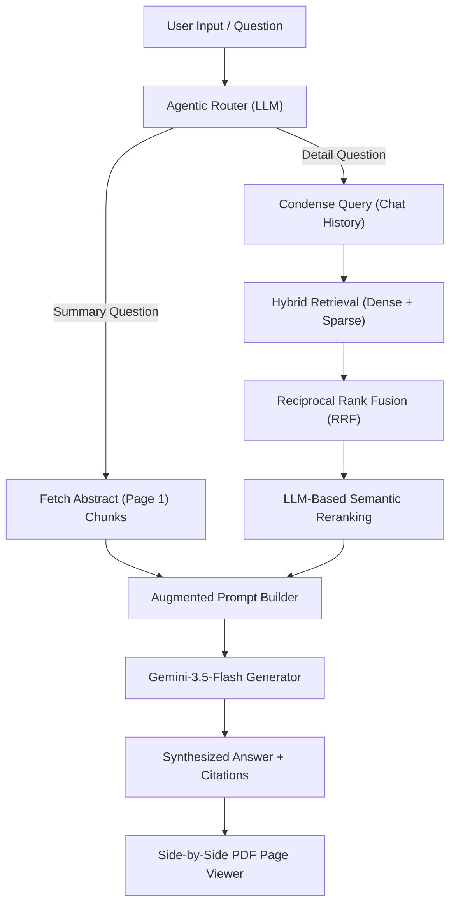

# 🔬 ResearchLens — Advanced AI Research Paper Q&A (RAG) Assistant

ResearchLens is a production-grade, state-of-the-art **Retrieval-Augmented Generation (RAG)** assistant designed to let you upload, index, and chat with complex academic research papers. Built using Google's modern Gemini API, ChromaDB, and Streamlit, it is engineered with premium algorithmic enhancements typically only found in commercial AI products.

---

## 🎨 Interactive Premium UI Features

- **Split-Screen PDF Page Viewer 📄:** Click any citation (`🔍 View Page X`) under an answer to instantly split the screen and render the exact PDF page locally inside the app as a high-resolution image!
- **Conversational Memory (Query Condensation) 💬:** Gemini rewrites follow-up questions dynamically to include past context, allowing a true, continuous chatbot experience.
- **Dynamic Metadata Filtering 🎛️:** A sidebar dropdown allows you to restrict semantic searches to specific papers, reducing token cost and noise.
- **Advanced Hybrid Search 🔍:** Natively fuses **Dense semantic vector search** with **Sparse keyword search** using **Reciprocal Rank Fusion (RRF)**.
- **LLM-Based Semantic Reranking 📊:** Retrieves double the relevant chunks and employs Gemini to score and filter them down to the absolute best 5 contexts.
- **Agentic Query Routing 🤖:** Automatically classifies questions into factual `"search"` or global `"summarization"` streams, dynamically pulling page-1 abstract chunks for global paper summaries.
- **Self-Healing API Core 🛡️:** Built-in exponential backoff handlers that automatically pause and retry requests on `429 RESOURCE_EXHAUSTED` rate limits or socket connection resets.

---

## 🏗️ Technical Architecture



### Tech Stack
- **Core LLM:** `gemini-3.5-flash`
- **Embedding Model:** `gemini-embedding-001` (3072-dimensional dense vectors)
- **Vector Database:** `ChromaDB` (Cosine similarity, persistent storage)
- **PDF Extraction & Rendering:** `PyMuPDF` (`fitz`)
- **Frontend UI:** `Streamlit` (Premium glassmorphism dark styling)

---

## 🚀 Quick Start

### 1. Clone & Set Up Directory
```bash
git clone <your-repo-url>
cd ResearchLens
```

### 2. Create Virtual Environment
```bash
# Windows
python -m venv venv
.\venv\Scripts\activate

# macOS / Linux
python3 -m venv venv
source venv/bin/activate
```

### 3. Install Dependencies
```bash
pip install -r requirements.txt
```

### 4. Configure Environment Variables
Create a `.env` file in the root directory:
```env
# Get a free key from: https://aistudio.google.com/apikey
GOOGLE_API_KEY=your_gemini_api_key_here
```

### 5. Download Landmark Sample Papers (Optional)
Run the built-in downloader to automatically pull 10 landmark AI research papers (Transformers, BERT, GPT-2, ResNet, etc.) from ArXiv:
```bash
python download_papers.py
```

### 6. Run the Web Application
```bash
streamlit run app.py
```
Open **http://localhost:8501** in your browser!

---

## 📂 Project Structure

```text
ResearchLens/
├── papers/                 # Local folder containing your academic PDFs (ignored by git)
├── chroma_db/              # Local vector database persistent storage (ignored by git)
├── src/
│   ├── config.py           # Configuration parameters and models
│   ├── ingest.py           # PDF loader, text extractor, and text splitter
│   ├── embeddings.py       # Gemini embedding generator with backoff retries
│   ├── vector_store.py     # ChromaDB client, Hybrid Search, and RRF re-scorer
│   ├── llm.py              # Gemini response generator, query condenser, and reranker
│   └── rag_chain.py        # RAG pipeline orchestrator and Agentic Query Router
├── app.py                  # Main Streamlit web frontend
├── requirements.txt        # Python package dependencies
├── .gitignore              # Git ignore rules for keys and envs
└── README.md               # You are here!
```

---

## 🛡️ License

This project is open-source and available under the [MIT License](LICENSE).
